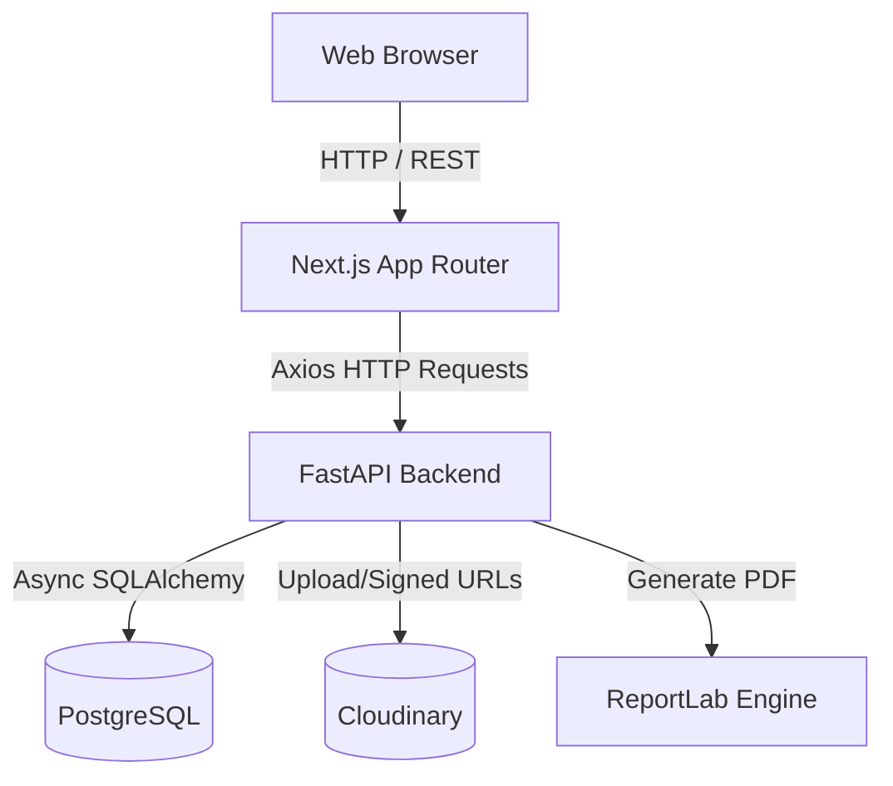

# System Architecture Document

## High Level Architecture

The Elsan Clinic Management System follows a decoupled client-server architecture, utilizing a **Next.js Frontend**, a **FastAPI Backend**, and a **PostgreSQL Database**.

## Frontend Architecture
The frontend is built with **Next.js 15 (App Router)**.
- **Routing**: Folder-based routing (`app/admin/dashboard`, `app/admin/prescriptions`).
- **State Management**: Server state is managed heavily by **React Query (TanStack)** to cache API responses, handle loading states, and automatically refetch data upon mutations.
- **Form Handling**: **React Hook Form** paired with **Zod** schema validation ensures strict client-side validation before hitting the API.
- **Styling**: **Tailwind CSS** combined with **ShadCN UI** components provides a highly customizable, accessible, and responsive design system.
- **API Layer**: A centralized `axios.ts` instance configured with `withCredentials: true` intercepts 401 errors and handles token refreshes automatically.

## Backend Architecture
The backend is built with **FastAPI** utilizing a **Clean Architecture** / Repository-Service pattern.
- **Routers (`api/`)**: Define HTTP methods, paths, request/response models, and inject dependencies (Services, current user).
- **Services (`services/`)**: Contain the core business logic (e.g., generating a PDF, logging an audit event, pushing to Cloudinary).
- **Repositories (`repositories/`)**: Encapsulate all raw SQLAlchemy database queries. They return Pydantic-agnostic SQLAlchemy models to the services.
- **Models (`models/`)**: SQLAlchemy declarative base models defining the exact PostgreSQL schema and relationships.
- **Schemas (`schemas/`)**: Pydantic v2 models defining strictly typed Request (Input) and Response (Output) shapes.

## Storage Architecture
We utilize **Cloudinary** for all asset management to reduce database bloat and bandwidth costs on the primary application server.
- **Doctor Signatures**: Stored in `elsan-clinic/doctor-signatures/`.
- **Prescription PDFs**: Stored in `elsan-clinic/prescriptions/`.
- **Security**: Assets are uploaded as raw bytes from memory. For downloading, the backend utilizes the Cloudinary SDK to generate cryptographically signed, expiring URLs (`GET /signed-url`).

## Authentication & Role-Based Access Flow
Authentication uses stateless **JSON Web Tokens (JWT)**.
1. User POSTs to `/api/v1/auth/login`.
2. Backend validates credentials against hashed passwords (`bcrypt`).
3. Backend sets `HTTPOnly` cookies containing the `access_token` and `refresh_token`.
4. Subsequent requests automatically include the cookie.
5. The `@require_roles(["SUPER_ADMIN", "DOCTOR"])` decorator evaluates the JWT payload. If the user's role is not in the list, a `403 Forbidden` is returned.

## PDF Generation Flow
1. Doctor submits Prescription Data via Frontend.
2. Backend `PrescriptionService` saves data to PostgreSQL.
3. `QRService` generates a verification QR code (PNG bytes).
4. `PrescriptionPDFGenerator` uses `ReportLab` to draw an A4 canvas (Header, Patient Info, Medicine Table, QR Footer) completely in memory (`io.BytesIO`).
5. `CloudinaryService` streams the in-memory PDF bytes directly to Cloudinary.
6. The Cloudinary URL is returned and saved to the Database.
