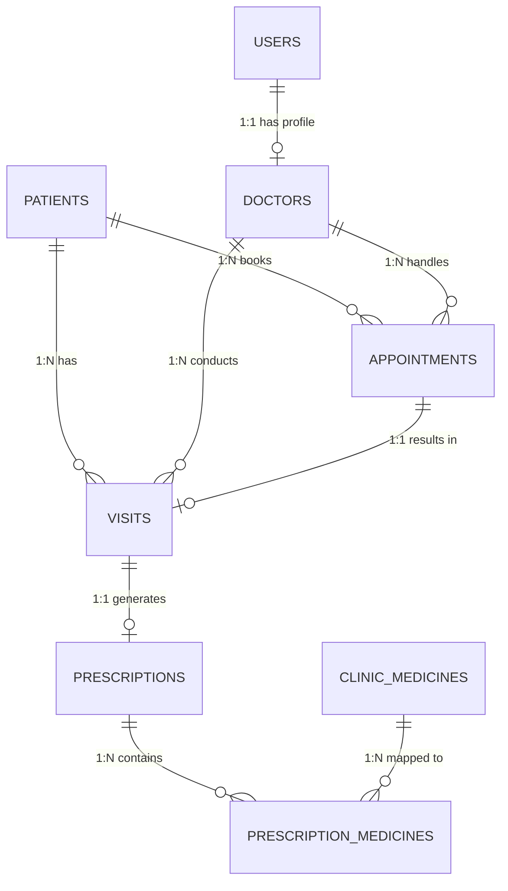

# Database Documentation

The Elsan Clinic Management System utilizes **PostgreSQL** with **SQLAlchemy 2.0 (Async)** as its ORM. The database makes heavy use of UUIDs for primary keys to ensure global uniqueness and prevent enumeration attacks.

## Entity Relationship Summary

---

## Tables Dictionary

### 1. `users`
**Purpose**: Stores authentication credentials and role assignments for all system users (Admins, Doctors, Receptionists).
- `id` (UUID, PK): Unique identifier.
- `full_name` (String): User's legal name.
- `email` (String, Unique, Indexed): Used for login.
- `password_hash` (String): BCrypt hashed password.
- `role` (Enum): `SUPER_ADMIN`, `RECEPTIONIST`, `DOCTOR`.
- `is_active` (Boolean): For soft disabling accounts.

### 2. `doctors`
**Purpose**: Extended profile information exclusively for users with the `DOCTOR` role.
- `id` (UUID, PK): Unique identifier.
- `user_id` (UUID, FK, Unique): Links to `users.id`.
- `specialization` (String): e.g., "Cardiology".
- `signature_url` (String): Cloudinary secure URL for prescription signatures.
- `signature_public_id` (String): Used for deleting/replacing Cloudinary assets.

### 3. `patients`
**Purpose**: Centralized medical record and demographics for patients.
- `id` (UUID, PK): Unique identifier.
- `patient_code` (String, Unique, Indexed): Human-readable ID (e.g., "P-1001").
- `full_name`, `age`, `gender`, `blood_group`: Demographics.
- `phone` (String, Indexed): Crucial for WhatsApp delivery.

### 4. `appointments`
**Purpose**: Tracks scheduled visits between a patient and a doctor.
- `id` (UUID, PK)
- `patient_id` (UUID, FK): Links to `patients.id`.
- `doctor_id` (UUID, FK): Links to `doctors.id`.
- `appointment_date` (Date, Indexed), `appointment_time` (Time).
- `status` (Enum): `SCHEDULED`, `COMPLETED`, `CANCELLED`.

### 5. `visits`
**Purpose**: The actual clinical record generated when an appointment is fulfilled or a walk-in occurs.
- `id` (UUID, PK)
- `appointment_id` (UUID, FK, Nullable): Links to origin appointment.
- `symptoms` (Text): Patient complaints.
- `diagnosis` (Text): Doctor's diagnosis.
- `doctor_notes` (Text): Private notes not visible on prescription.

### 6. `prescriptions`
**Purpose**: The digital document state generated from a visit.
- `id` (UUID, PK)
- `visit_id` (UUID, FK)
- `pdf_url` (String): Cloudinary link.
- `pdf_public_id` (String): Cloudinary tracking ID for regeneration.
- `download_count` (Integer): Analytics tracking.
- `sent_whatsapp` (Boolean): Status flag for Phase 7 delivery.

### 7. `clinic_medicines`
**Purpose**: A globally reusable library of medicines configured by the clinic admin to speed up doctor entry.
- `id` (UUID, PK)
- `name` (String, Unique, Indexed): The commercial or generic name.
- `default_dosage`, `default_frequency`: Speed up prescription writing.

### 8. `prescription_medicines`
**Purpose**: Junction table representing the exact dosage instructions for a specific prescription.
- `id` (UUID, PK)
- `prescription_id` (UUID, FK, Cascade Delete): Parent prescription.
- `clinic_medicine_id` (UUID, FK, Nullable): Link to library (if applicable).
- `medicine_name`, `dosage`, `frequency`, `duration_days` (Strings/Int).
- `morning`, `afternoon`, `night` (Boolean): Time-of-day flags.

### 9. `audit_logs`
**Purpose**: Enterprise security tracking for file access and system modifications.
- `id` (UUID, PK)
- `user_id` (UUID, FK): Who performed the action.
- `action` (String): e.g., "DOWNLOAD_PDF", "REGENERATE_PDF".
- `entity_type`, `entity_id`: What was modified.
